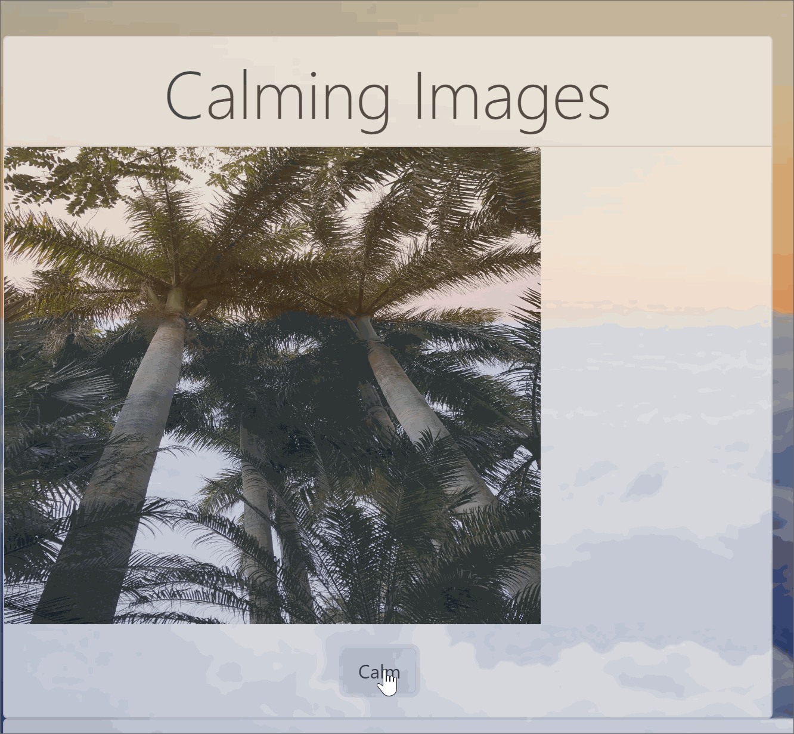

# Welcome to The Great Stress Escape!

The Great Stress Escape is a full-stack application that provides content intended for immediate relief of stress when users are frustrated but cannot leave the situation that they are in. Users click on buttons to receive calming images, inspirational quotes, or soothing sounds. Users may also enter their own inspirational quote if desired once out of the stressful situation. The the anti-stress modalities may be used in combination with each other and for as long as desired, although the intent is to provide quick, rapid relief in a few moments.

## Sample User Stories:

As a user, I am stuck in this meeting where the boss has been chewing me out in front of the whole team for about 30 minutes. I am about to lose it, but if I get up and leave I'll get fired. Fortunately I have my computer open and my boss will never know that I'm looking at pictures of beautiful scenery to calm myself down.

As a user, I am a parent who has both a screeching infant and a toddler throwing a tantrum. I can't leave them alone - what kind of parent would I be - but I cannot listen to this for one more second without going crazy. I'm going to get a few inspirational quotes and listen to some soothing music - turned up loud so I can hear it over the kids' ruckus! Maybe it will calm them down too - it doesn't hurt to hope!

## Visit the site at: https://thegreatstressescape.herokuapp.com/

## Features:

* Bootstrap and Handlebars
* Node and Express Server
* MySQL and Sequelize
* GET and POST routes
* Requests of existing data and sending new data to the database

## Creation Team Members:

* Ben Zamora
* Jason Violet
* Lynn Amsbury
* Sara Overby
* Zoe Gonzales

## Instructions:

### Calming Images

Clicking the “Calm” button will display randomly generated, relaxing images from the creators' own collections.

<!--  -->

### Inspiring Words

Clicking the “Get Inspiration” button will display random quotes from the npm iQuotes package. Clicking the  “Give Inspiration” button will display quotes submitted by users.

<!--  -->

### Soothing Sounds

Clicking the “Relax” button will call the Spotify API and provide users with a selection from a mix of comedy channels, soothing music, and nature sounds. Users can continue to click the "Relax" button until they find a selection to their liking.

<!--  -->

## Built With:
- HTML5
- CSS3
    - Bootstrap 4
- Semantic Template
    - Handlebars
- JavaScript
    - jQuery
- AJAX
    - Spotify API
- Database
    - SQL
    - MySQL Workbench
    - Sequelize
- NPM
    - iQuotes
- Server
    - Node.js
    - Express

## Deployment:

### App deployed at https://thegreatstressescape.herokuapp.com/

## Future Directions:

### In future updates to the app, we plan to:

* Improve the mobile-friendliness of the design.
* Add administrative oversight and functionality to verify that the quotes users input themselves are indeed inspirational and appropriate.
* Incorporate user accounts.

### Please note that this is a group project that I participated in; I do not own the original repository. I forked the project code into my repository so I could display it in my body of work. The original repository is https://github.com/zoe-gonzales/Project2.